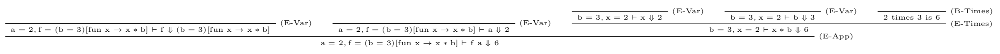

# EvalML4

## About

書籍「プログラミング言語の基礎概念」の中で用いられている導出システム**EvalML4**において，判断を入力として導出を出力するプログラム．判断は式とその値からなる．

## 実行手順

```
make
./evalML4 problem/[問題番号(70~77)]
```

```
a = 2, f = (b = 3)[fun x -> x * b] |- f a evalto 6 by E-App {
  a = 2, f = (b = 3)[fun x -> x * b] |- f evalto (b = 3)[fun x -> x * b] by E-Var {};
  a = 2, f = (b = 3)[fun x -> x * b] |- a evalto 2 by E-Var {};
  b = 3, x = 2 |- x * b evalto 6 by E-Times {
    b = 3, x = 2 |- x evalto 2 by E-Var {};
    b = 3, x = 2 |- b evalto 3 by E-Var {};
    2 times 3 is 6 by B-Times {}
  }
}
```



## 推論規則


